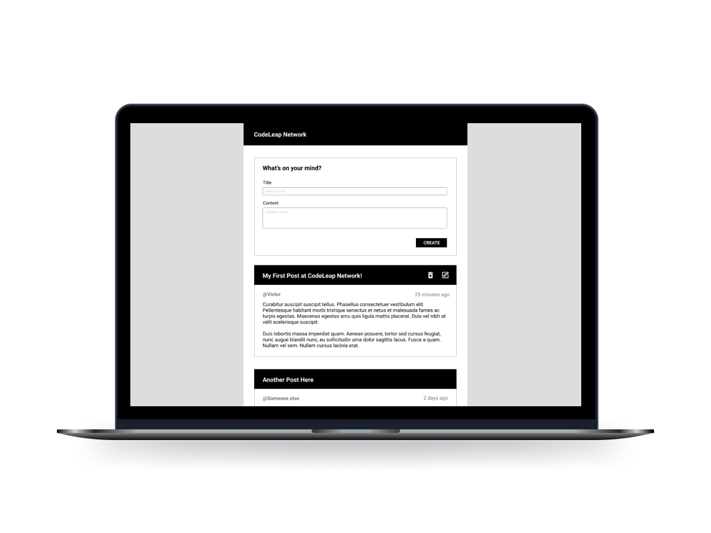

        

  

This project was bootstrapped with [Create React App](https://github.com/facebook/create-react-app).

## Project

Welcome to the CodeLeap coding test!
The goal was to create a basic CRUD using redux.
